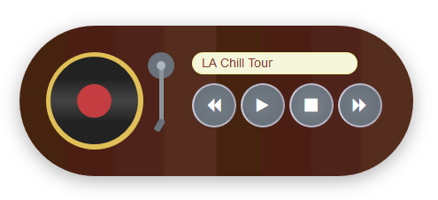

# Задача 3. Аудиоплеер

#### В рамках домашнего задания к лекции «Способы поиска нужного HTML-элемента»

## Описание

Необходимо реализовать функционал четырёх кнопок аудиоплеера:

1. `Play` – начинает играть текущая песня, состояние кнопки меняется на `Pause`.
2. `Pause` – останавливается воспроизведение текущей песни, состояние кнопки меняется на `Play`. При нажатии на кнопку `Play` воспроизведение начнется с момента, на котором было остановлено.
3. `Stop` – останавливает воспроизведение текущей песни, состояние кнопки не меняется. При нажатии на кнопку `Play` воспроизведение начинается с начала песни.
4. `Back` – происходит переключение на предыдущую песню.
5. `Next` – происходит переключение на следующую песню.

Песни должны листаться по кругу с помощью кнопок `Back` и `Next`.

По окончании проигрывания текущей песни автопереключения на следующую не происходит.

## Интерфейс

1. `Play`

`<i class="fa fa-play"></i>`, вложенный в кнопку `<button class="playstate">`

2. `Pause`

`<i class="fa fa-pause"></i>`, вложенный в кнопку `<button class="playstate">`

3. `Stop` `<button class="stop">`
4. `Back` `<button class="back">`
5. `Next` `<button class="next">`

Нужно реализовать функционал кнопок аудиоплеера, управляя свойствами тега `audio`. Визуальное отображение проигрывания песни происходит с помощью добавления или удаления класса `play` на элементе `
`.

Дополнительно, при переключении песен при помощи кнопок `Back` и `Next` нужно выводить название песни с помощью обновления свойства `title` у тега ``.

## Материалы

### Реализация

В онлайн-песочнице на [CODEPEN](https://codepen.io/solarrust/pen/QpobMe).

В репозитории на [GitHub](https://github.com/netology-code/hj-homeworks/tree/master/html-element-collection/audioplayer).

### Песни для плеера

1. [LA Chill Tour](https://netology-code.github.io/hj-homeworks/html-element-collection/audioplayer/mp3/LA Chill Tour.mp3)
2. [This is it band](https://netology-code.github.io/hj-homeworks/html-element-collection/audioplayer/mp3/This is it band.mp3)
3. [LA Fusion Jam](https://netology-code.github.io/hj-homeworks/html-element-collection/audioplayer/mp3/LA Fusion Jam.mp3)

### Инструкция по выполнению домашнего задания

#### В онлайн-песочнице

Потребуется: только ваш браузер.

1. Открыть код в [песочнице](https://codepen.io/solarrust/pen/QpobMe).

2. Нажать на кнопку «Fork».

3. Выполнить задание.

4. Нажать кнопку «Save».

5. Скопировать адрес страницы, открытой в браузере.

6. Прислать скопированную ссылку через личный кабинет на сайте [netology.ru](http://netology.ru/).    

#### Локально

Потребуется: браузер, редактор кода, система контроля версий [git](https://git-scm.com), установленная локально, и аккаунт на [GitHub](https://github.com/) или [BitBucket](https://bitbucket.org/).

1. Клонировать репозиторий с домашними заданиями `git clone https://github.com/netology-code/hj-homeworks.git`.

2. Перейти в папку задания `cd hj-homeworks/html-element-collection/audioplayer`.

3. Выполнить задание.

4. Создать репозиторий на [GitHub](https://github.com/) или [BitBucket](https://bitbucket.org/).

5. Добавить репозиторий в проект `git remote add homeworks %repo-url%`, где `%repo-url%` — адрес созданного репозитория.

6. Опубликовать код в репозиторий `homeworks` с помощью команды `git push -u homeworks master`.

7. Прислать ссылку на репозиторий через личный кабинет на сайте [netology.ru](http://netology.ru/).
